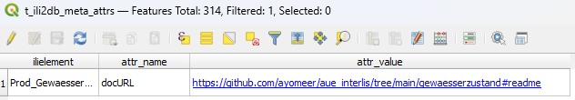

# docButton QGIS Plugin

## Usage

Simply select a layer that belongs to an INTERLIS model and hit the `Modell Dokumentation` button. If the model has a documentation URL configured ([more information here](#database-model-prerequisites)), this will open the documentation page in the default internet browser.

## Installation
To install the plugin, follow these steps:
1) Download the latest release `docButton_install.zip` file from the [releases page](https://github.com/ayomeer/docButton/releases).
2) In QGIS, open the plugin manager, go to the "Install from ZIP" section, choose the downloaded zip and press the `Install Plugin` button:

3) Configure the database connection to use to retrieve the documentation link from. To do this, find the plugin settings under `Plugins > docButton > Settings`. This setting can be changed again at any time.

## Database Model prerequisites

The plugin looks for a documentation URL in the INTERLIS meta attribute `docURL` in `t_ili2db_meta_attrs`. For example:
