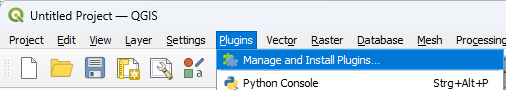
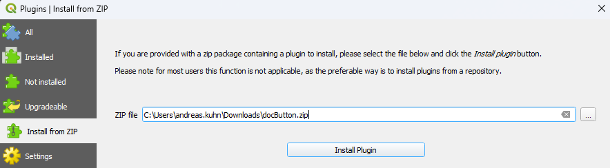

# docButton QGIS Plugin

## Usage

## Installation
To install the plugin, follow these steps:
1) Download the latest release `docButton.zip` file from the [releases page](https://github.com/ayomeer/docButton/releases).
2) In QGIS, open the plugin manager, go to the "Install from ZIP" section, choose the downloaded zip and press the `Install Plugin` button:

